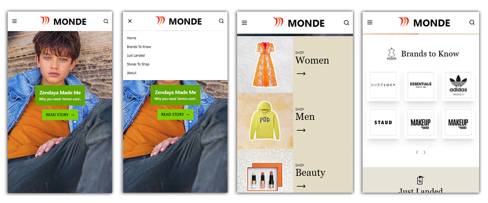
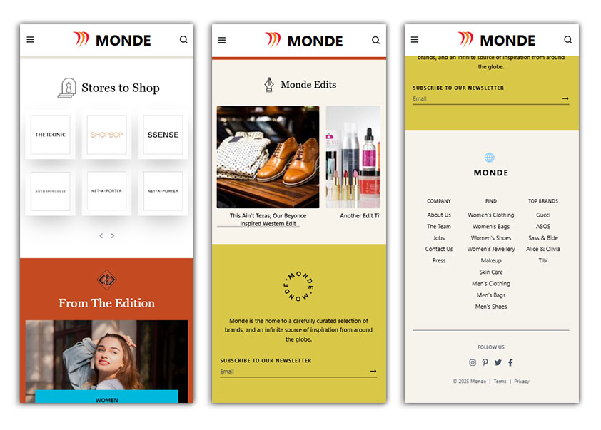
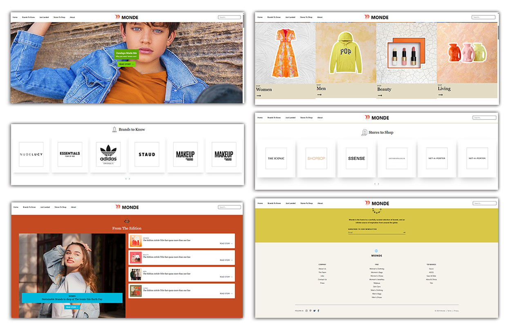

# React + Vite + Tailwindcss

A modern, responsive e-commerce landing page built with React, Vite, and TailwindCSS.
It features a sleek design, fast performance, and mobile-first responsiveness, perfect for showcasing products and driving user engagement.
Includes hero section, product highlights, feature sections, contact us, and a call-to-action to maximize conversions.

## Mobile View Screenshots

## Desktop View Screenshots

## Directory Structure

assets
   └──screenshots  
public
   |───brands
   |───category
   |───edition
   |───edits
   |───icons
   |───products
   └──stores
src       
|  └──assets
|  └──components
|        │──brands.jsx
|        │──edition.jsx
|        │──footer.jsx
|        │──footer.jsx
|        │──header.jsx
|        │──hero.jsx
|        │──justLandedSection.jsx
|        │──mondeEdits.jsx
|        │──newsLetterSection.jsx
|        │──productCard.jsx
|        │──shopNav.jsx
|        └──stores.jsx
|──img
|──App.css
|──App.jsx
|──index.css
└──main.jsx
index.html
postcss.config.js
tailwind.config.js
vite.config.js
